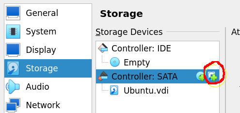

## Overview
A hands-on project to simulate and document IT administration and security tasks in a homelab environment.

## Table of Contents
- [Environment Setup](#environment-setup)
  - [Mounting a Volume](#mounting-a-volume)
  - [Incident Response Simulation](#incident-response-simulation)
  - [Operating System Patching](#operating-system-patching)
  - [Deploying Nessus and Splunk](#deploying-nessus-and-splunk)
  - [Network Traffic Analysis](#network-traffic-analysis)
  - [Automation with Ansible](#automation-with-ansible)
- [Results and Learnings](#results-and-learnings)
- [Future Enhancements](#future-enhancements)
- [References](#references)

___
### Environment-setup
This homelab was built using virtualization tools and software to simulate a real-world IT environment.
- **Virtualization**: Oracle VM VirtualBox [Download](https://www.oracle.com/virtualization/technologies/vm/downloads/virtualbox-downloads.html)
- **Operating Systems**:
  - Ubuntu [Download](https://ubuntu.com/download)
  - Rocky Linux (RHEL) [Download](https://rockylinux.org/download)
___
### Mounting a volume
**Objective**: Add, format, and mount a new virtual disk in Linux systems. 

**Steps**:

1. **Add a virtual disk**:
   - Make sure your virtual machine is ran at least once and set up before moving on.
   - Make sure your virtual machine is in the state of `Powered Off` or shutdown before preceeding or it will cause problems.
  
     

   - Click on `Settings` of the virtual machine.
   - Go to `Storage` and click the small icon under your selected controller to add a new virtual disk.

     

   - Highlight your selected virtual machine and click `Create`, at the bottom click on `Expert Mode` if you are in `Guided Mode`.

     

   - Let's create a virtual disk of 64GB. Imagine we are connecting a new hard drive of 64GB to the machine.
  
     

   - Click `Finish` and select the unattached hard disk we just created then click `Choose`, we should see that it is added on to the virtual machine successfully.

     

   - Now start your virtual machine, go to your terminal and start `parted`
  
     ```bash
     sudo parted
     ```

   - It will display what hard drive you are currently using so don't accidentally erase your entire drive!
     - Example output:
       
     ```bash
      NU Parted 3.6
      Using /dev/sda  # This is the drive you are CURRENTLY using, do not select this. 
      Welcome to GNU Parted! Type 'help' to view a list of commands.
      (parted)
     ```

   - Show all of your available devices
     
     ```bash
     print devices
     ```
     
     - Example output:
       
      ```bash
      /dev/sda (107GB)
      /dev/sdb (68.7GB) # Note that the 64GB we added on our VM is in GiB, so in parted it will appear larger in number, but they are the same size, both uses different measurements.
      ```

   - Create a new partition on the new disk that we added. In this case it is `/dev/sdb`.

     ```bash
     select /dev/sdb 
     ```


