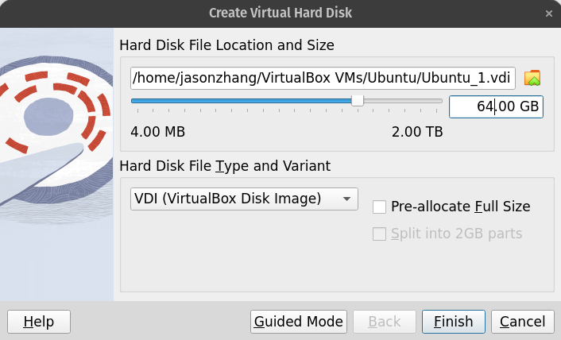
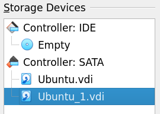

## Overview
A hands-on project to simulate and document IT administration and security tasks in a homelab environment.

## Table of Contents
- [Environment Setup](#environment-setup)
  - [Setting up Disk Partitions](#setting-up-disk-partitions)
  - [Mounting a Volume](#mounting-a-volume)
  - [Incident Response Simulation](#incident-response-simulation)
  - [Operating System Patching](#operating-system-patching)
  - [Deploying Nessus and Splunk](#deploying-nessus-and-splunk)
  - [Network Traffic Analysis](#network-traffic-analysis)
  - [Automation with Ansible](#automation-with-ansible)
- [Results and Learnings](#results-and-learnings)
- [Future Enhancements](#future-enhancements)
- [References](#references)

___
### Environment-setup
This homelab was built using virtualization tools and software to simulate a real-world IT environment.
- **Virtualization**: Oracle VM VirtualBox [Download](https://www.oracle.com/virtualization/technologies/vm/downloads/virtualbox-downloads.html)
- **Operating Systems**:
  - Ubuntu [Download](https://ubuntu.com/download)
  - Rocky Linux (RHEL) [Download](https://rockylinux.org/download)
___
### Setting up disk partitions
**Objective**: Add, format, and mount a new virtual disk in Linux systems. 

**Steps**:

1. **Add a virtual disk**:
   - Make sure your virtual machine is ran at least once and set up before moving on.
   - Make sure your virtual machine is in the state of `Powered Off` or shutdown before preceeding or it will cause problems.
  
     

   - Click on `Settings` of the virtual machine.
   - Go to `Storage` and click the small icon under your selected controller to add a new virtual disk.

     

   - Highlight your selected virtual machine and click `Create`, at the bottom click on `Expert Mode` if you are in `Guided Mode`.

     

   - Let's create a virtual disk of 64GB. Imagine we are connecting a new hard drive of 64GB to the machine.
  
     

   - Click `Finish` and select the unattached hard disk we just created then click `Choose`, we should see that it is added on to the virtual machine successfully.

     

2. - Now start your virtual machine, go to your terminal and start `parted`
  
     ```bash
     sudo parted
     ```

   - It will display what hard drive you are currently using so don't accidentally erase your entire drive!
     - Example output:
       
     ```bash
      NU Parted 3.6
      Using /dev/sda  # This is the drive you are CURRENTLY using, do not select this. 
      Welcome to GNU Parted! Type 'help' to view a list of commands.
      (parted)
     ```

   - Show all of your available devices
     
     ```bash
     print devices
     ```
     
     - Example output:
       
      ```bash
      /dev/sda (107GB)
      /dev/sdb (68.7GB) # Note that the 64GB we added on our VM is in GiB, so in parted it will appear larger in number, but they are the same size, both uses different measurements.
      ```

   - Select the new disk that we added. In this case it is `/dev/sdb`.

     ```bash
     select /dev/sdb 
     ```

   - Now, we want to create a partition table on our new disk. We are basically choosing a structure that our disk will use to store data. (It will remove all data on disk).
  
     ```bash
     mklabel 
     ```
  
   - It will ask for a lable type, for modern systems we will be typing in `gpt`. In older systems we would use `msdos`. If your disk has data it will ask you to type `Yes` to destroy all data in order to continue.

     ```bash
     gpt
     ````
  
  - After our partition table is created, we will make a new partition. Basically meaning we are choosing when the partition starts and ends and its type. It will start at 1MiB to ensure the disk works correctly with metadata. Note that ending in 64GiB will not work because 64GiB != 68.7GB. 
    
    `mkpart PART-TYPE [FS-TYPE] START END`

    ```bash
    mkpart primary ext4 1MiB 68.7GB
    ```
  - Double check if everything is set

    ```bash
    print partitions
    ```
    - Example output:
    
          Number  Start   End     Size    File system  Name     Flags
          1      1049kB  68.7GB   68.7GB  ext4         primary

  - You can name your disk as well, here we are naming our new disk as `backups`. If you have exited parted make sure to select the disk you want to name again. We can also use parted within our terminal but I don't recommened it as it might require more parameters.
    
    ```bash
    name 1 backups
    ```
___
### Mounting a volume

**Objectives:**

**Steps:**

- Get the name of the drive first
  
  ```bash
  lsblk -f
  ```
  Example output:
  
  ```
  sdb                 
  └─sdb1
  ```

  Now we confirm that the drive we need to mount is sdb1, which is in this path `/dev/sdb1`
  
- If the drive is blank you need to format the drive using
  ```bash
  sudo mkfs.ext4 /dev/sdb1
  ```

- Then, let's create a folder and mount this drive into that folder.
  ```bash
  sudo mkdir /mnt/backups && sudo mount /dev/sdb1 /mnt/backups
  ```
- Verify the mount
  ```bash
  df -h
  ```
- unmount if needed
  ```bash
  sudo umount /dev/sdb1
  ```
  or
  ```bash
  sudo umount /mnt/backups
  ```
  AND you're done!

  - For advanced mounting options:
 
  ```bash
  mount -o [options] [device] [mountfolder]
  ```
  
    - `ro` read only
    - `rw` (default) read + write
    - `noexec` disables execution perms
    - `nosuid` disables set-user-identifier and set-group-identifier
    - `noatime` do not update access time when file is read


___
### References

[Redhat Documentation](https://docs.redhat.com/en/documentation/red_hat_enterprise_linux/9/html/managing_storage_devices/disk-partitions_managing-storage-devices?utm_source=chatgpt.com#guid-partition-table_disk-partitions)


